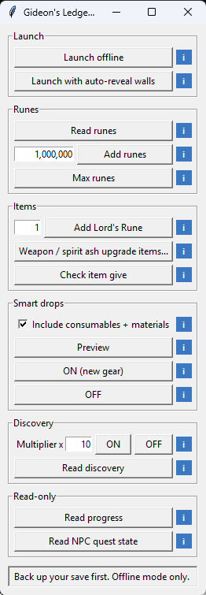

# Gideon's Ledger

A tiny offline trainer for Elden Ring (Windows, Python + tkinter + [pymem](https://pypi.org/project/pymem/)).
One file, no installer, no game files modified.

**Offline only.** It refuses to attach while Easy Anti-Cheat is running. Never use it online: you will get banned.
Back up your save (`ER0000.sl2`) before using any trainer. Not affiliated with FromSoftware or Bandai Namco.



## Requirements

- Windows and the **Steam** version of Elden Ring (Steam must be installed; the launcher sets the Steam app id). Other storefronts are untested.
- Python 3 with `pymem` only if you run the script; the EXE needs nothing.

## Features

- **Launch offline**: starts `eldenring.exe` directly with the Steam app id set, so Easy Anti-Cheat never loads.
- **Runes**: read, add, or max out (999,999,999).
- **Add Lord's Rune**: calls the game's own item-give function, so the item registers properly.
- **Enemy rune multiplier**: multiplies the runes every enemy drops by 1 to 100 (the `getSoul` field of `NpcParam`). Reload the
  area after turning it ON. OFF or closing the app restores the original values.
- **Add any item**: search weapons, armor, talismans, spells, goods and ashes of war by name, or type an item ID. Needs an item list
  you build from your own copy of the Hexinton cheat table, see below.
- **Back up my save**: copies your whole save folder to `save_backups\<timestamp>` next to the app. Old backups are never deleted.
- **Remembers your settings** (amounts, multipliers, window position) in `ledger_settings.json` next to the app.
- **Discovery**: multiplies the item-discovery curve (Arcane) by 1 to 100; OFF restores the exact original values.
- **Smart drops**: every enemy drop lot that offers weapons or armor you don't own always drops them
  (optionally also consumables and materials). Refreshes as you pick things up. OFF or closing the app restores
  the original drop table byte-for-byte.
- **Read progress**: story flags, endings, Great Runes, boss kills and graces found, per region, read live from
  the game's event flags (read-only). Needs a flag list, see below.
- **Read NPC quest state** (optional): per NPC, the dialogue they would say right now, decoded from their talk scripts. Needs `data/npc_steps.json`, built from your own game files (not shipped).
- **Launch with auto-reveal walls** (optional): starts the game through [Mod Engine 3](https://github.com/garyttierney/me3)
  with a profile you supply. See below.

Everything finds game memory by byte-pattern scan, not fixed addresses, so it survives most game patches. If a
pattern stops matching after an update it refuses to write instead of guessing.

## Run

```
pip install -r requirements.txt
python gideons_ledger.py
python gideons_ledger.py --selftest   # no game or pymem needed
```

Looks for the game at the default Steam path (`C:\Program Files (x86)\Steam\steamapps\common\ELDEN RING\Game`). If it is elsewhere, **Launch offline** asks for the folder once and remembers it in `game_dir.txt` next to the app.
Click **Smart drops OFF** / **Discovery OFF** (or just close the window) before quitting the game session.

**No Python?** Download `GideonsLedger.exe` from the [Releases](../../releases) page. It is unsigned, so Windows SmartScreen
or antivirus may warn; the source here is the full program, and you can build it yourself with
`pyinstaller --onefile --windowed gideons_ledger.py`. Optional `data/` and `me3/` folders go next to the EXE.

## Item list for "Add any item" (optional)

The item search needs `data/items.json`. This repo does not ship one, because the names and IDs come from the Hexinton Elden Ring
cheat table, which you download yourself. With the table's `.zip` (or the `.CT` inside it) in hand, run:

```
python build_items.py "C:/path/to/Hexinton ... .zip"
```

That writes `data/items.json` (about 5,900 items) next to the app. Without it, the Add item window still works if you type an item
ID by hand.

## Progress flag list (optional)

"Read progress" needs `data/event_flags.json`, a list of `[flag id, name, category, subcategory]`. This repo does not ship one:
the most complete list I found ([er-save-manager](https://github.com/Hapfel1/er-save-manager), `src/er_save_manager/data/event_flags.json`)
has a source-available license that forbids redistribution, so download it yourself for personal use. NPC questline steps
are not in any list I could find, so those are not reported.

## Auto-reveal walls (optional)

**Steam must be running** for this launch mode. The button checks, and starts Steam for you (waiting up to a minute) if it isn't already open; if that fails, start Steam yourself and click again.

The button runs `me3\bin\me3.exe launch -p walls.me3` next to the script. This repo does not ship Mod Engine 3
or a wall mod. To use it, download Mod Engine 3 into `me3\`, and write a `walls.me3` profile pointing at a mod that
auto-reveals illusory walls (for example *Auto Reveal Illusory Walls* on Nexus Mods). Mod files built from game
data are not redistributed here. Mod Engine 3 blocks online matchmaking by default; keep it that way.

## Bugs and feature requests

Found a bug or want a new feature? Please post it on the [Discussions board](../../discussions). Include what you clicked, the
status text shown in the app, and your game version if you can. The app also writes `ledger.log` next to the
EXE (or script); attach it, or paste its last lines. It holds errors and launch steps, no personal data beyond the folder path.

## Credits

Memory signatures and structure offsets come from
[The-Grand-Archives/Elden-Ring-CT-TGA](https://github.com/The-Grand-Archives/Elden-Ring-CT-TGA).

## License

MIT, see [LICENSE](LICENSE).
